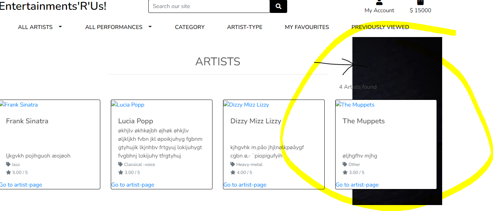
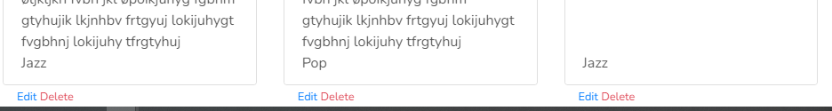
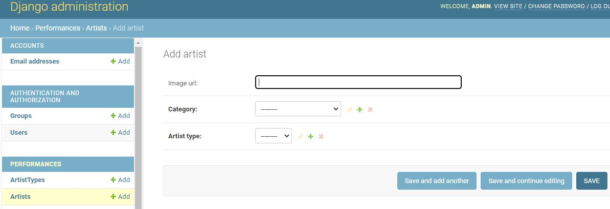
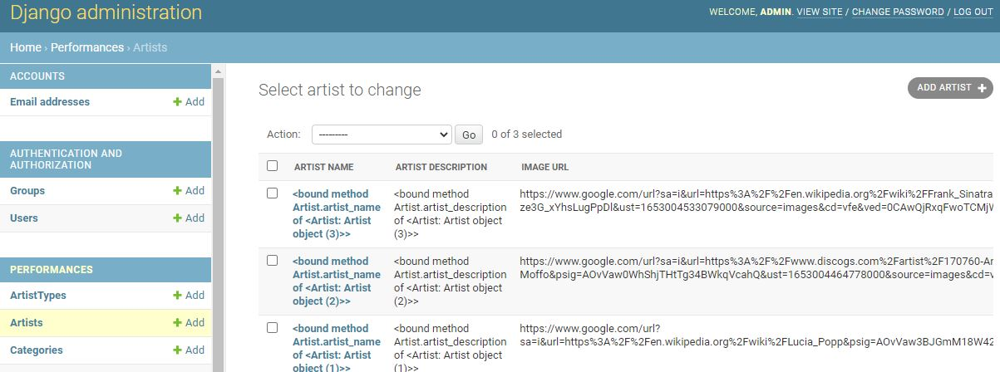
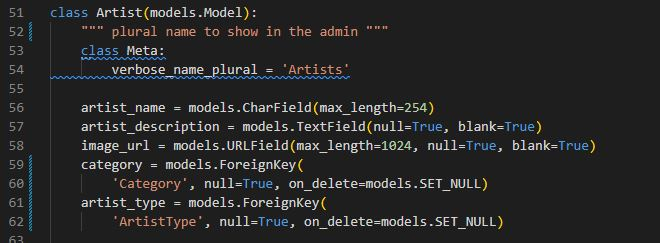
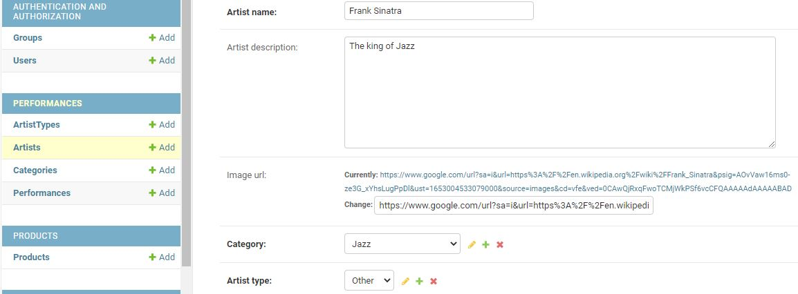
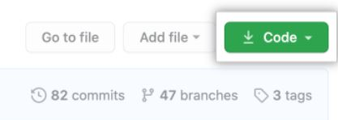

# Entertainments'R'Us
## A website where people can find and connect to freelance artists like singers, actors and entertainers in order to hire them for entertainment at celebrations, weddings and other festive occations.

This project is only just begun, and I have used instructions from the Code Institute "Boutique Ado"-project to set it up. This is most evident in main.py, main.css and index.html. I have started to adapt the code to my project, but they are still mainly the same as in that project. 

I was hoping to get at least the first page deployed and working for this assignment deadline, but sadly I have not been able to fix my bug(s) in time, so I have to submit as it is.

Click [here](https://entertainments-r-us.herokuapp.com/) to view the website

## User Experience (UX)
### User stories:
There will be three types of users on this website; 
the customers, the artists and the admins.

### First time customer-users goals
A customer-user wants to explore the artists work in order to find someone they like. If they are looking for something particular, they want to be able to sort the artists by main-category (singer, toastmaster, clown etc) and by sub-categories (like opera, jazz and rock for instance, for singers).

### First time artist-users goals
Artist-users wants it to be easy to set up a profile and add info, pictures and links to videos on YouTube etc. They want to be hired for jobs with certainty of being paid.

### Returning customer-user goals
A customer-user wants to be able to contact the artist they wish to hire, to assess price and availability. They want to know what feedback the artist has had from previous customers, and perhaps be able to sort artists by that feedback. They want to have a logg of the artists they have looked at before. They want to leave a feedback for artists they have already hired. They want a secure payment-system (the artist should not be paid before they have performed).

### Returning artist-user goals
Artist-users want a secure payment-system. The payment should be confirmed received by the app before they perform (but not delivered to the artist until the job is done). They want to be able to give feedback about customers who have hired them, and they want only people who have actually hired them to be able to leave feedback about their performance.

### Admin-user goals
The admin-user wants to update and take care of the page when needed. They will also need to take out "reports" for accounting and analytics-purposes.

### Site owner goals
The main goal for the site-owner is to make live entertainment more accessible and to make it easier for customers to find artists they want to hire, and for freelance-artists to be able to connect with the larger public. Also to make a small profit pr transaction in order to pay for maintenance to keep the site up-to-date, functioning and secure and for other overhead-costs.

## Design

### Colour scheme:
....

### Typography:
....

### Imagery:

## Wireframes

## Features

- Ability to browse artists/performances and to buy products either logged in or not.
- Ability to add products to shoppingbag and go to secure checkout to pay through stripe.
- A login-feature with profile-page for each user.
- Order-history and form to update shipping-info available on profile-page for logged-in users.
- Users that have "staff-user"-rights (between customer and superuser) can add, edit and delete artists, performances and products. This is the usertype used by the artists offering their services on the website, so that they can add new performances and edit info as they wish, without having to go through a website-admin.
- Users can search for keywords in performances-name and description, and get the related performance.
- Users may choose to see only artist of a particular type (choir or bands for instance), og to see performances of a certain genre (f.ex. jazz). Or to sort performances by artist, or artists by artist-rating, etc
- When you sort by a category, a box with the chosen genre is shown under the page-title, to inform the user of what choice has been made.
- How many results the page has, is shown descretely on the right side of the page.
- The main-nav buttons for "All artists" and for "All performances" have a direct link on the button to a page with all the instances, but also have a dropdown-menu on the side, to see the page sorted by for ex. by name or by artist.

#### Future features:
- The search-function currently only searches through titles and descriptions in the performances-model. The search will in the future also include artists, categories, artisttypes etc. to span all the information contained in the website.
- There will also be a possibility to sort artists by how much their cheapest and most costly products are (price low-high and high-low), and to sort performances by how many views they have had.
- Currently all the users with "artist-user-type" (staff) has access to delete and edit all the performances, artists and products on the website. They should naturally only be able to add, edit and delete items regarding their own artist (or artists). The plan is to add a owner-field to the artist-model, so that only the user that creates an artist has the right to edit that artist an all performances and products related to that artist.

## Issues overcome
### Challenge with link from "all performances"-page to "artist-page"
There is a difficulty retreiving the django-artist.id at the all performances-page in order to link to the individual artist-page, because the performances-class only had the artist_id-filed, and not the actual artist-id. The artist-page-view takes primary key artist.id (an integer) as input, but when retrieving the artist_id from "all performances"-page, it comes up as Artist: Artist object (6), instead of as 6. Whith sting-method on Artist-class "return self.artist_name" it comes up as the artist_name ex. Lucia Popp. Neither option works in the url and view for artist-page. The issue is not overcome yet, but will (hopefully) be solved eventually.

### Overlay doesn't cover the home-page background-image
I tried so many things to fix the overlay-div that did not cover the page underneath. Working with css and html, but nothing made any difference. In the end, the problem was solved super-simply, by removing two classes from the overlay-div (100% and container). 

### Links to edit and delete should not be clicked by accident
The edit and delete-links were at first so small and so close together, and also close to other links, that they could very easily be clicked by accident. The problem was sorted in a few different ways, by adding some distance to orther links, and by adding a horisontal line between these links at the bottom, and the rest of the content.

## Technology used
### Programming languages:
- html
- css
- js
- python
- github
- Heroku
- Postgres database
- 

### Frameworks, libraries and programs:
- Bootstrap
- Google Fonts
- Font-awsome
- Django (incl. django-allauth, dj-database-url, django-crispy-forms)
- Werkzeug
- stripe payments

## Testing

### Validation:
HTML validation
CSS validation
JS validation

### Testing for user stories in UX-section:

### Further testing:
#### Test on different screen sizes:
Expected: X when Y
Testing: do Y
Result: The site did not respond due to ..."A" or: the site acted as expected and did X
Fix: Did Z to the code because of problem..."A"

#### Test on different browsers:
Expected: X when Y
Testing: do Y
Result: The site did not respond due to ..."A" or: the site acted as expected and did X
Fix: Did Z to the code because of problem..."A"

### Fixed bugs:
#### Bug 1

Problem when deplying to Heroku "Error while running '$ python manage.py collectstatic --noinput'. Push rejected, failed to compile Python app." Heroku suggests the error has to do with static assets and directs to article: https://devcenter.heroku.com/articles/django-assets, where entereing a code-snippet into my settings.py-file is suggested as answer to problem. That fix did not change anything, so I connect directly to Heroku to try to disable the collect-static with "heroku config:set DISABLE_COLLECTSTATIC=1" as suggested by the article "if all else fails". But that just crashed the whole thing... I'll try to return the code for DATABASE in settings.py back to original (local database). Still not working.
In the log at Heroku I found the error h10, so I searched it and found this thread (https://stackoverflow-com.translate.goog/questions/14322989/first-heroku-deploy-failed-error-code-h10?_x_tr_sl=en&_x_tr_tl=no&_x_tr_hl=no&_x_tr_pto=op,sc) that suggests it may be something wrong with the Procfile. I removed a "space" from the Procfile, as suggested, and now there is still an error in Heroku, but it has changed from "crashed" do "down", and the new error is h14 "No web-processes running". I have worked back and forth with the Procfile to try to get it working, but still no luck, and my hard deadline is today, so I will leave it for now and fix  it before the resubmission.  

#### Bug 2
Problem missing fields in artist-admin and performance-admin. Artist name and several other fields are added in the artist-class, but does not show up in the django-admin.

The problem turned out to be some missing migrations that did not go through because of missing info in required fields. After temporary adding "default='MISSING'" to the required fields (artist_name, performance_name and artist_id), the migrations went through, and the correct fields are showing in the admin. The default-value has been removed again, so that input is required on new entries.

#### Bug 3

### Unfixed bugs:

## Deployment
This project was developed using Gitpod, committed to git and pushed to GitHub using git-extensions in Gitpod. Attepted deployd through Heroku, but not yet successful.

### Steps to deploy this page on Heroku from GitHub repository:

### Forking the GitHub repository:
Go to the project-page in Github https://github.com/Gurimarie/Entertainments-r-us/tree/main and click on the fork-symbol in the top-right corner of the page.

On GitHub.com, navigate to your fork, open it, and click the Code-button. 

Choose your preferred way of cloning the repository (HTTPS, SSH or Github CLI), and then open Git Bash. Change the current working directory to the location where you want the cloned directory.
Type git clone, and then paste the URL you copied earlier. It will look like this, with your GitHub username instead of YOUR-USERNAME: "$ git clone https://github.com/YOUR-USERNAME/Entertainments-r-us". Press Enter. Your local clone will be created.

### Making a local clone:

## Credits

### Code:

- https://github.com/PaulFrankling/discover-north-yorks used for README-structure.
- In setting up this project I have followed closely the run-through-project "Project Boutique Ado" in the Code Institute courses.

### Content:

### Media used:

### Acknowledgements:
